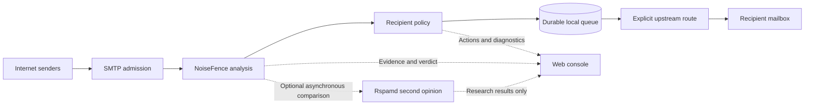
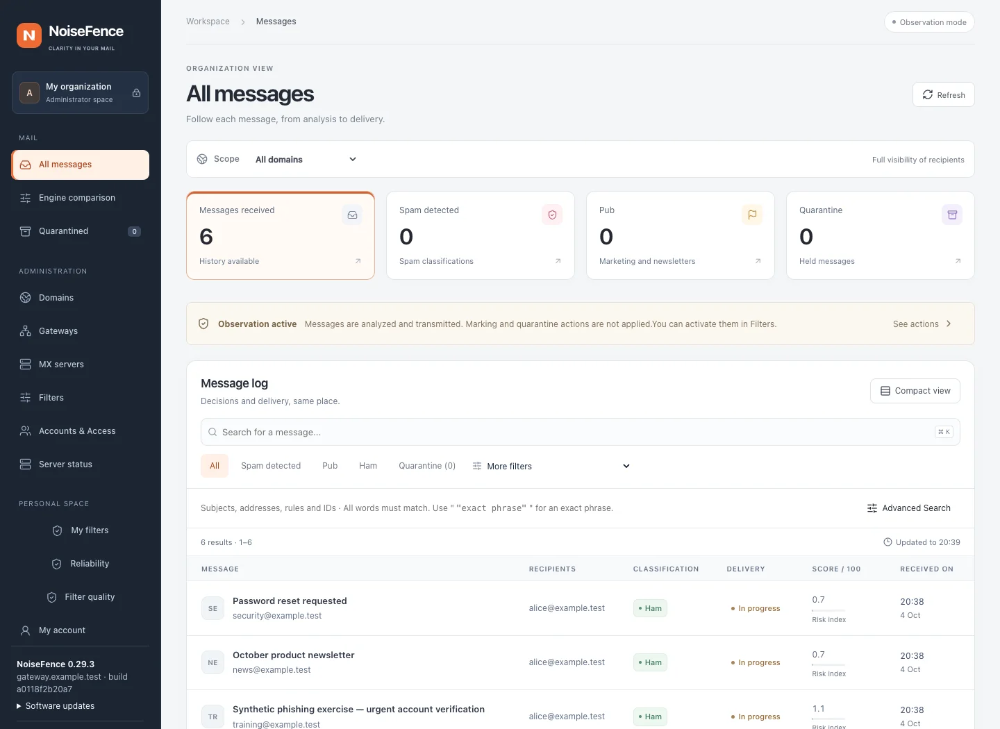
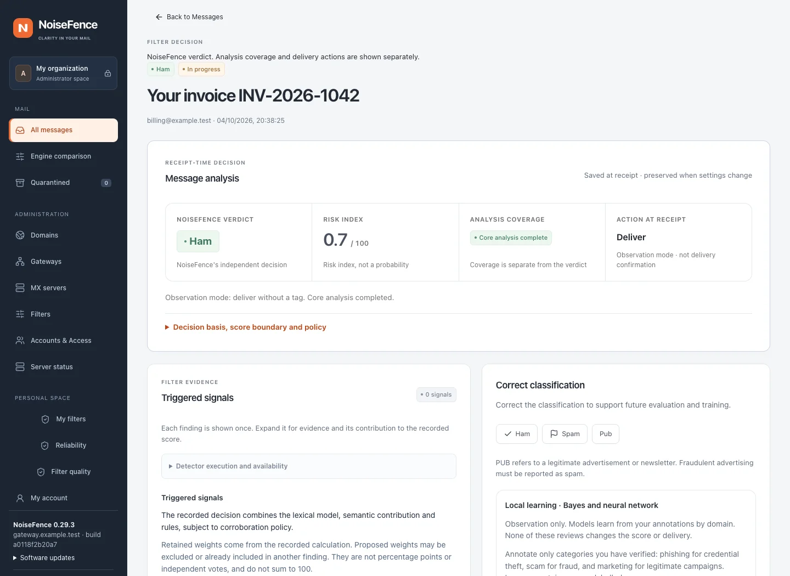
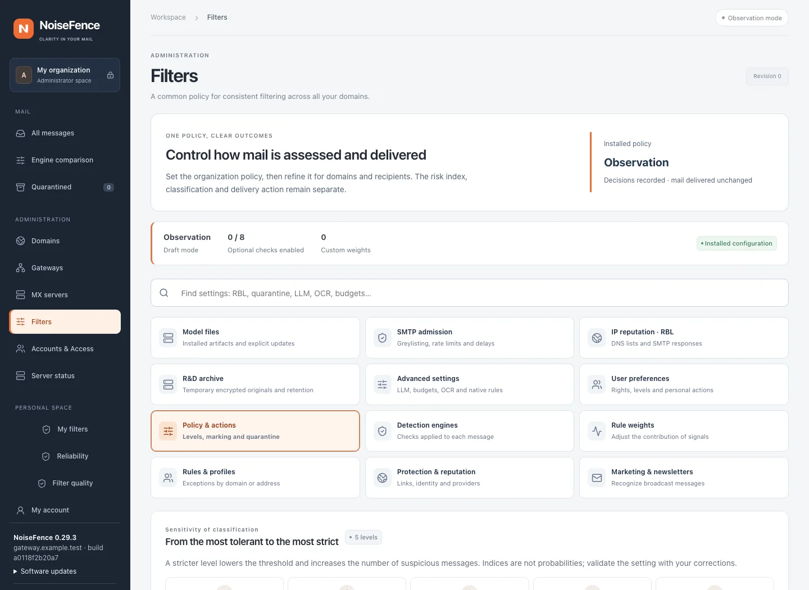
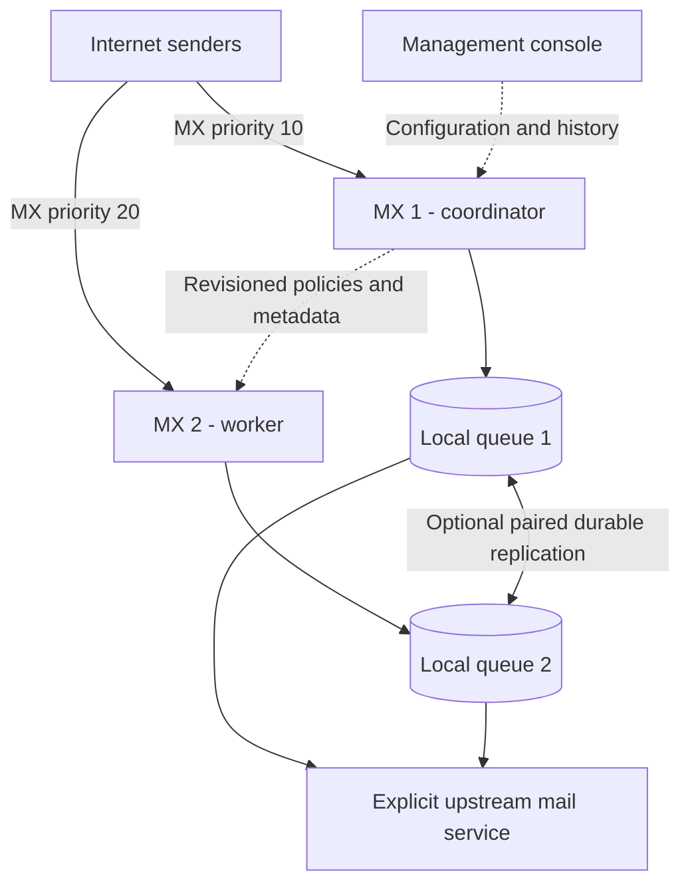

# NoiseFence

**An open-source Rust SMTP security gateway with an English management console.**

NoiseFence receives mail for configured domains, records the analysis, stores accepted messages durably, and forwards them to an explicit upstream route. It supports Proton Mail as an upstream, with separate compatibility checks before subject tagging.



NoiseFence decides independently. Rspamd is an optional comparison service, not a decision or delivery dependency. Observation mode records classifications while delivering without tags; active policies can tag or quarantine messages.

NoiseFence is open source under **GPL-3.0-only**. Release archives contain Linux binaries for amd64 and arm64, the console, configuration examples, deployment tools and documentation. No default account, password, paid API key or trained model is included.

Repository: [github.com/crdffrance/NoiseFence](https://github.com/crdffrance/NoiseFence) · License: [GPL-3.0-only](LICENSE)

> Optional temporary R&D originals: encrypted collection with an automatic stop date, expiry and per-MX quotas. Configure **Filters → R&D archive**; see [research archive](docs/research-archive.md).

## A look inside

Real captures of the English console running locally with **synthetic `example.test` messages**. This is an untrained, observation-only demo with external checks disabled and no upstream delivery service. Its scores and counts illustrate the interface, **not detection accuracy**. Click an image to inspect it at full size.

**Message history** — search across permitted recipients and distinguish classification, delivery state and risk index.

[](docs/images/console-messages.webp)

**Message analysis** — the independent verdict, risk index, analysis coverage and action at receipt are presented separately, with evidence and feedback below.

[](docs/images/console-analysis.webp)

**Filter administration** — find policies, RBLs, detection engines, provider budgets, rules and recipient exceptions from one settings area.

[](docs/images/console-filters.webp)

Capture details and refresh instructions: [Screenshot guide](docs/images/README.md).

## Start here

| Task | Guide |
| --- | --- |
| Try NoiseFence with Docker or install a Linux release | [Installation](docs/installation.md) |
| Configure domains, gateways, filters, RBLs and budgets | [Web configuration](docs/web-configuration.md) |
| Understand scores, classifications and delivery actions | [Filtering policy](docs/filter-policy.md) |
| Read the message-header schema and remote SMTP replies | [Headers](docs/message-headers.md), [SMTP diagnostics](docs/smtp-diagnostics.md) |
| Deploy more MX servers and protect accepted messages | [Multiple MX servers](docs/multi-mx.md), [Two-copy availability](docs/high-availability.md) |
| Check SMTP readiness, memory pressure and recovery | [Production readiness](docs/production-readiness.md) |
| Evaluate accuracy with human labels | [Quality](docs/quality.md), [Validation results](docs/validation-results.md) |
| Browse the remaining guides | [Documentation index](docs/README.md) |

## Operating-system compatibility

The **server runs on Linux in production**. The Web console is accessed through a browser; the administrator's computer does not need to run the server OS.

| Platform | Architecture | Status and installation path |
| --- | --- | --- |
| Debian 12 / 13 | amd64 (x86-64), arm64 (AArch64) | Production baseline. Use the matching [Linux release](https://github.com/crdffrance/NoiseFence/releases/latest) and systemd installer. |
| Other glibc-based Linux distributions | amd64, arm64 | Conditional native compatibility: glibc **2.36+**, systemd and Python **3.11+** for the supplied installation tools. Validate the target host; this is not a certification of every distribution. |
| Linux with Docker Engine + Compose | amd64, arm64 | Container deployment path. Use the Linux production template, persistent storage and host networking; verify that SMTP sees the real client IP. |
| macOS | Apple Silicon / Intel | Development or local Docker evaluation. No native macOS release or production service installer. Native development has been exercised on Apple Silicon; Intel is not a CI target. |
| Windows | A host capable of running Linux containers | Local evaluation through Docker Desktop or a Linux VM; not a native Windows service. No Windows binary or Windows CI coverage. |
| Alpine / other musl-only environments | Any | Published native binaries require glibc; no musl release. Use the supplied Debian-based Linux container on a compatible Docker host. |
| 32-bit systems | Any | No published binary or CI target. |

Release CI builds and tests both Linux architectures on Ubuntu 24.04 runners, with release binaries built inside a Debian Bookworm container. See the [release workflow](.github/workflows/release.yml) and [installation guide](docs/installation.md) for exact requirements.

Desktop evaluation uses **Linux containers** and requires Docker Desktop **4.34+** with host networking enabled; see [Docker's platform requirements and limitations](https://docs.docker.com/engine/network/drivers/host/). Desktop networking is not validated as a public production MX setup.

## Local Docker evaluation

Install Docker Engine with Compose on Linux, then run from a checkout. Docker Desktop requires its host-networking option (4.34 or later):

```sh
docker compose build
docker compose run --rm noisefence init
docker compose run --rm noisefence user-add admin --admin
docker compose up -d
```

Enter a password when prompted. Open **http://127.0.0.1:18080**. The example publishes SMTP on **127.0.0.1:2525**, accepts only the example recipients, and has no working external delivery route. Messages remain queued until you provide a test sink or a valid upstream. It is an evaluation setup; follow the installation guide before accepting real mail. `docker compose down` preserves the named data volume.

## What the gateway does

- SMTP/ESMTP, STARTTLS, SIZE, 8BITMIME and PIPELINING, with recipient allowlists or explicit domain catch-all policies. Connections, message size, parsing and processing are bounded.
- Durable disk spool and SQLite WAL; acceptance follows persistence. Each recipient has independent retry and delivery state. Optional paired MX replication requires **two durable copies before `250`**.
- Native Rust content rules, authentication, DNS/IP/domain reputation, local classifiers and advisory comparison models. Optional integrations include ClamAV, local OCR/QR, CRDF, VirusTotal and Scaleway text analysis.
- A definitive **Spam / Ham / Pub** classification, shown separately from the **0–100 risk index**, analysis coverage and delivery action. Missing checks remain visible and are never converted into a fabricated score or evidence of safety.
- Observation, tagging and quarantine policies; organizational, domain and recipient profiles; custom rules; marketing classification; user feedback and controlled candidate evaluation.
- An English Web console with scoped message search, remote SMTP transcripts, filter explanations, accounts, MFA, invitations, provider credentials and quotas, configuration revisions and multiple MX management.

All messaging and filter policies can be managed through the console. Host installation remains server-side: ports, TLS keys and certificates, storage, worker sockets, model artifacts and replication identities. Model replacement follows its validation procedure; the Web editor cannot bypass it with an arbitrary file path.

## Multiple MX servers and durability

Both MX nodes receive, analyze and relay mail. The coordinator manages shared policies and consolidated history; it is not a mandatory hop in the SMTP delivery path.



Multiple MX records alone do not replicate accepted messages. With **mandatory paired replication**, SMTP acceptance waits for two durable copies; an unavailable peer causes a temporary `451` response. Replica takeover and console recovery require fencing and controlled promotion, not an automatic two-node election. See [multi-MX management](docs/multi-mx.md) and [high availability](docs/high-availability.md).

## Defaults and limits

**Observation is the default.** It records decisions while delivering without subject tagging or quarantine. Paid providers are inactive until configured with an authorized key and budget. Optional active URL following is off by default; it has separate network restrictions and resource limits.

The content risk index is **not a calibrated spam probability**. Native points, log-odds, model confidence and fusion estimates have different meanings. NoiseFence does not add them together as independent votes. See the filtering policy for the exact precedence and units.

The target of at least 95% capture with at most 0.1% false positives requires measurement on recent, representative, independently labelled traffic. It is not a demonstrated product-wide guarantee. Historical public corpora and selected user corrections alone cannot establish it.

Proton may evaluate forwarded mail differently because the connecting IP changes and subject modification can break DKIM. ARC sealing does not automatically make the gateway trusted. Keep the existing delivery path until the [Proton compatibility matrix](docs/proton-validation.md) passes; tagging has a separate gate for `[SPAM]` and `[PUB]`.

SMTP is not exactly-once delivery: a lost final acknowledgement can cause a retry and duplicate delivery. Paired replication protects accepted bodies, but console recovery still requires verified fencing and a controlled promotion. With mandatory two-copy durability, an unavailable peer delays new mail with `451`.

## Build and test

The validated build toolchain is Rust 1.98 and Node 24. Use a Unix development host; production targets Linux.

```sh
cargo build --locked --features semantic
cd web
npm ci
npm test
npx tsc --noEmit
npm run lint
npm run build
cd ..
cargo test --locked --features semantic
cargo fmt --check
cargo clippy --locked --all-targets --features semantic -- -D warnings
```

For development without Docker, copy `config/development.toml` to a private configuration, set `web.public_origin` to the exact browser origin, then run `init`, `user-add admin --admin` and `serve` with that configuration. The example SMTP route is a loopback test sink, not an Internet relay.

`scan message.eml` performs local extraction and classification. `analyze message.eml` runs configured checks without queuing or delivering the message; external providers may receive the configured indicators or text excerpts. See the CLI help and [installation guide](docs/installation.md) for an isolated SMTP test that also appears in the console.

Bodies and attachments are removed after all recipient outcomes and required replica acknowledgements are resolved. Pending or held messages follow their queue/quarantine policy. Metadata and retained features normally expire after 30 days. Exports and backups have independent retention; hashed features are not an anonymity guarantee.

Contributions are welcome: read [CONTRIBUTING.md](CONTRIBUTING.md). Report vulnerabilities through [SECURITY.md](SECURITY.md). See [THIRD_PARTY.md](THIRD_PARTY.md) for dependencies and upstream acknowledgements.

Optional: [independent Rspamd comparison](docs/rspamd-comparison.md) provides asynchronous second opinions in the console. Rspamd never changes NoiseFence's verdict, score or delivery decision.

The [calibration workbench](docs/calibration-workbench.md) compares NoiseFence and Rspamd against human labels, isolates holdouts, and manages shadow candidates from the Web console.
